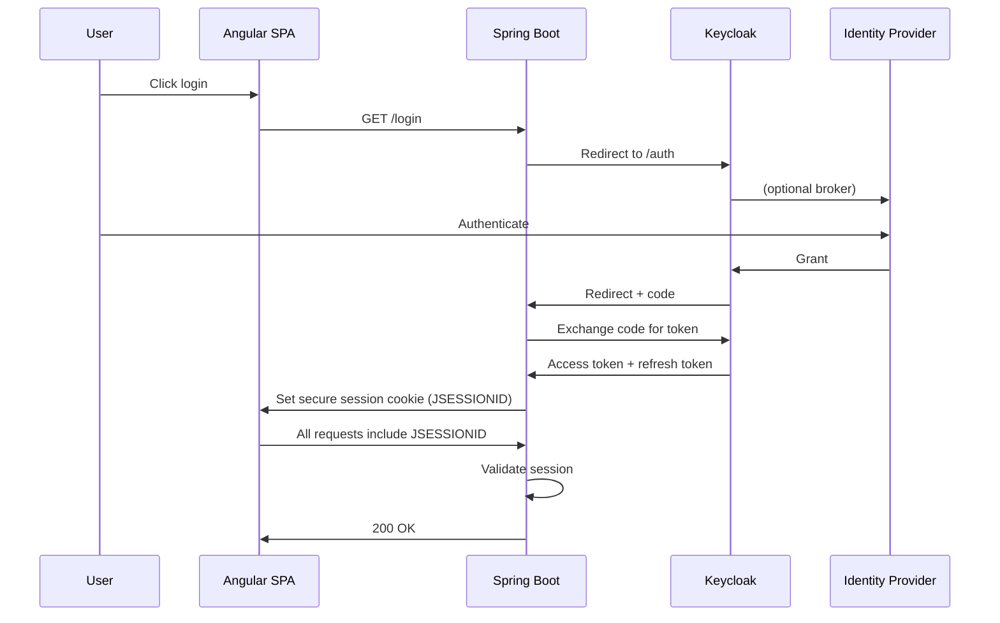
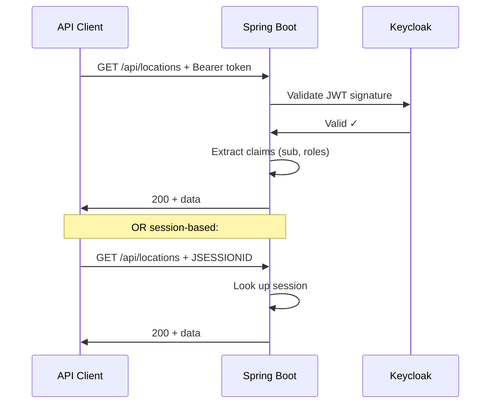

# Architecture

## How It Works

### Browser Flow (OAuth2 Session)



**Key points:**
- User never sees tokens in the browser (stored server-side in session)
- Tokens exchanged in backend-to-backend channel (secure)
- SPA authentication via httpOnly, secure session cookie
- CSRF protection enabled for state-changing requests

---

### API Flow (JWT Bearer or Session)



**Key points:**
- Bearer tokens validated against Keycloak public key (no network call per request)
- Session cookies validated locally (cached key, no round-trip)
- Failed auth returns `401 {"error":"Unauthorized"}` — no redirects (prevents fixation)

---

## Security Chains

The app runs **two independent Spring Security filter chains**:

### 1. API Chain (`/api/**`)
- No session required
- Accepts: Bearer tokens OR session cookies
- Rejects unauthenticated with JSON `401`
- No CSRF (stateless)
- CORS enabled for frontend

### 2. Browser Chain (everything else)
- Requires session OR OAuth2 login
- Redirects unauthenticated to Keycloak
- CSRF protection enabled
- Session-based auth via JSESSIONID
- CORS enabled for frontend

Both chains share the same CORS configuration and JWT decoder.

---

## Data Layer

**MongoDB 7** stores:

| Collection | Purpose | Indexed By |
|-----------|---------|-----------|
| `users` | Synced from Keycloak on login | `_id` (userId from OIDC `sub` claim) |
| `locations` | Sample data (Central Park, Art Museum) | `_id` |
| `favourites` | User's favorite locations | `userId` |
| `friends` | User connections | `userId` |
| `fs.files` / `fs.chunks` | GridFS file storage | GridFS auto-indexes |

**Sample data** auto-initializes if collections are empty on startup.

---

## Token Lifecycle

### Access Token (short-lived, ~5 min)
- Issued by Keycloak
- Used by both SPA (via server-side session) and API clients
- Validated via Keycloak JWKS endpoint (public key)
- Scopes: `openid, profile, email`

### Refresh Token (long-lived, ~1 week)
- Issued by Keycloak
- Stored **server-side in Spring Security session** (not in browser)
- Used by backend to obtain new access tokens if expired
- Never exposed to JavaScript

### Session Cookie (JSESSIONID)
- Spring session backed by server memory (dev) or Redis (prod)
- httpOnly, Secure, SameSite=None
- Renewed on login
- Cleared on logout

---

## File Storage (GridFS)

Files uploaded via `/api/files` POST are stored in MongoDB GridFS:

```
User uploads 100MB file
  ↓
Spring Boot streams to MongoDB (never buffers in RAM)
  ↓
Stored in fs.files + fs.chunks (16MB default chunk size)
  ↓
User can download, share with other users, or delete
```

**Access control:**
- Only owner can download/delete
- Owner can share via `/api/files/{id}/share` (adds userId to share list)
- Non-owners cannot access file

---

## Upstream IdP Integration

Keycloak acts as a **broker** between the app and any identity provider:

```
App → Keycloak → Azure AD
App → Keycloak → Google
App → Keycloak → SAML IdP
App → Keycloak → Any OIDC provider
```

**No code changes required** — configure Keycloak identity providers, set broker link, done.

---

## Stateless vs Stateful

| Layer | Type | Benefit |
|-------|------|---------|
| Browser → API | **Stateful** (session) | No token in browser, CSRF protection, logout revokes immediately |
| External API | **Stateless** (JWT) | Scalable, no session needed, mobile-friendly |
| Keycloak ↔ Backend | **Stateless** (JWT) | Fast validation, leverages public key caching |

Both can be used simultaneously — frontend chooses based on use case.
