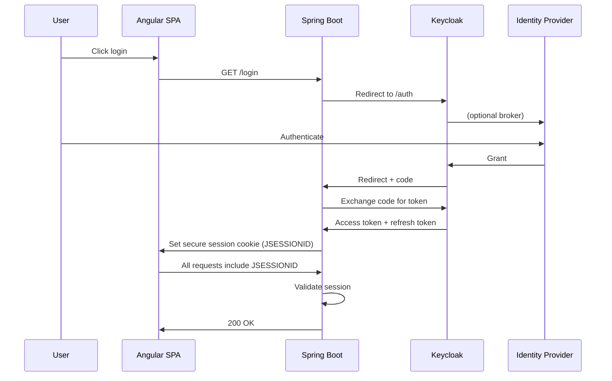
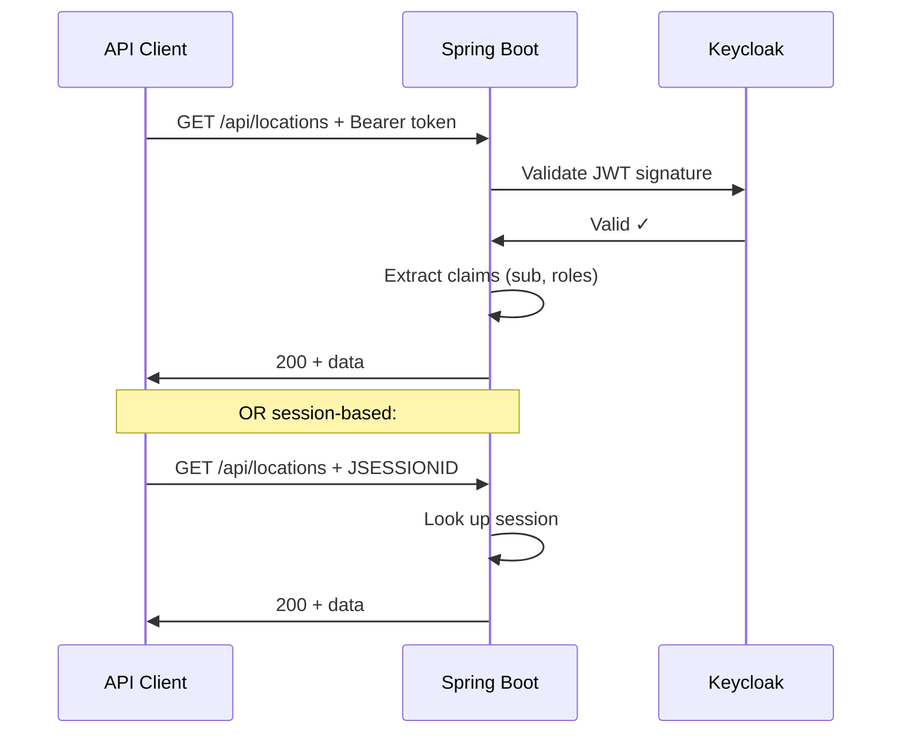

# Security Policy

## Authentication Flows

### Browser Flow (OAuth2 Session)



### API Flow (JWT Bearer or Session)



## Supported versions

| Version | Supported |
|---------|-----------|
| main    | ✓ Yes     |

## Reporting a vulnerability

Please **do not** open a public issue for security vulnerabilities.

Email: security@example.com

Include:
- Description of the vulnerability and its impact
- Steps to reproduce
- Any proof-of-concept code

You will receive a response within 48 hours. If confirmed, a fix will be released and you will be credited in the release notes (unless you prefer to remain anonymous).

## Scope

**In scope:**
- Authentication bypass or privilege escalation via Keycloak/OAuth2/JWT flows
- Data leakage between users (e.g., favorites endpoint returning other users' data)
- Unauthenticated access to protected endpoints
- XSS or injection via map popups or user-supplied data
- File upload restrictions bypassed

**Out of scope:**
- Issues requiring physical access to the server
- Vulnerabilities in Keycloak itself (report to [Keycloak security](https://github.com/keycloak/keycloak/security))
- Vulnerabilities in MongoDB itself
- Denial-of-service attacks
- Issues in upstream dependencies (report to the maintainer)

## Known hardening gaps (non-critical)

These are tracked as future improvements and are not considered undisclosed vulnerabilities:

### Token revocation on logout
- **What:** Logout clears session cookie, but Bearer tokens remain valid until expiry
- **Impact:** API clients with long-lived tokens can still authenticate after logout
- **Duration:** Token valid for ~5 minutes (Keycloak default), then expires naturally
- **Mitigation:** Configure shorter token lifetimes in Keycloak, or implement token blacklist (see [ARCHITECTURE.md](ARCHITECTURE.md))
- **Not needed for:** Browser-based users (session cookie cleared = immediate logout)

### Refresh token rotation
- **Why not included:** Refresh tokens stored server-side in session, never exposed to browser
- **Safe because:** Angular SPA has no direct access to tokens; backend handles token exchange
- **Where it matters:** Only for external API clients with direct refresh token access
- **Can be added:** Keycloak supports automatic refresh token rotation via broker settings

### WebSocket message validation
- **Status:** Not currently used (framework imported but not enabled)
- **If adding WebSockets:** Implement server-side payload validation + rate limiting

## Security best practices for deployment

### Secrets management
- Never commit `.env` files
- Use Kubernetes Secrets, Sealed Secrets, or HashiCorp Vault for sensitive values
- Rotate `SECRET_KEY_BASE` and Keycloak client secrets regularly

### HTTPS enforcement
- All cookies marked `secure=true` (requires HTTPS in production)
- Set `KEYCLOAK_ISSUER_URI` to public HTTPS URL (not HTTP)
- Ingress/load balancer must forward `X-Forwarded-Proto: https` correctly

### Session storage
- Dev: Spring session in memory
- Prod: Use Redis or database-backed session store (see [homelab-infra](https://github.com/mateirim/homelab-infra) for full k8s setup)

### File uploads
- 500MB per file limit (configurable in `application.properties`)
- Content-type validated on upload
- GridFS prevents directory traversal
- Access control: owner + share list only

### CORS
- Set `CORS_ALLOWED_ORIGINS` to specific domains (comma-separated)
- Avoid wildcards (`*`) in production
- Browser enforces, but server validates

### Keycloak admin API
- `KEYCLOAK_ADMIN_USERNAME` / `KEYCLOAK_ADMIN_PASSWORD` required only for cross-realm user listing
- Keep separate from user realm for isolation
- Consider read-only service account in production

## Testing security

```bash
# Run load tests (checks auth under load)
make test-load K6_TOKEN=<valid-jwt>

# Verify session handling
curl -v http://localhost:8080/api/user/info

# Test unauthenticated API (should return 401)
curl -i http://localhost:8080/api/locations

# Test CSRF (should reject state-changing requests without token)
curl -X POST http://localhost:8080/api/favourites -d '{}' -H "Content-Type: application/json"
```

## Security-related configuration

| Setting | File | Purpose |
|---------|------|---------|
| `server.servlet.session.cookie.secure=true` | `application.properties` | HTTPS-only cookies |
| `server.servlet.session.cookie.same-site=none` | `application.properties` | Allow cross-origin session (for CORS) |
| `CORS_ALLOWED_ORIGINS` | `.env` | Whitelist frontend domains |
| `spring.security.oauth2.client.registration.keycloak.scope` | `application.properties` | Request minimal scopes: `openid,profile,email` |
| `KEYCLOAK_ISSUER_URI` | `.env` | Public Keycloak endpoint (for JWT validation) |

## See also

- [ARCHITECTURE.md](ARCHITECTURE.md) — Authentication flows, token lifecycle
- [Infrastructure Template] — Full Kubernetes deployment setup
- [GitHub Security Policy](https://github.com/mateirim/springboot-keycloak-sso/security/policy)
